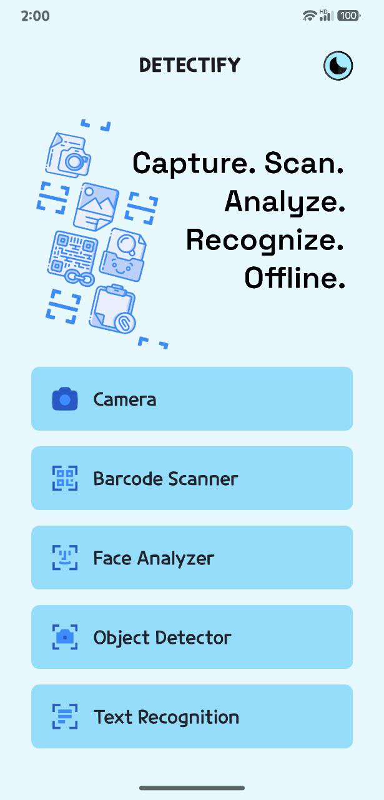
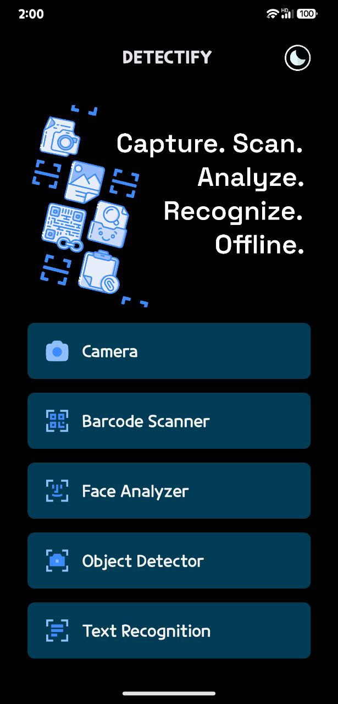

# Detectify

Detectify is an Android application designed to Scan, Analyze, Recognize, and Detect different surroundings in real time without any need of internet connection. This app is built using Kotlin and includes features mentioned below.

## Features

- Barcode Scanner
- Face Analyzer
- Object Detection
- Text Recognition
- and some more to come in future development

## Screenshots

## Download and Installation

### Prerequisites

- Android device running minimum Android version - 7.0 Nougat
- Enable installation from unknown sources in device settings

### Download APKs

You can download the latest APK files from the links below:

- [Detectify v1.0.0](apks/detectify_v1.0.0.apk)
- [Detectify v1.1.0](apks/detectify_v2.0.0.apk)
- [Detectify v1.2.0](apks/detectify_v2.1.0.apk)

### Installation Steps

1. Download the APK file from the above links to your Android device.
2. Open the downloaded APK file.
3. If prompted, enable installation from unknown sources.
4. Follow the on-screen instructions to install the app.

## Usage

Once installed, open the Detectify app from your app drawer. You can start using the features right away. For features details check features section.

## Contact

For any inquiries or support, please contact at [techsavvysanyam@gmail.com].

---
